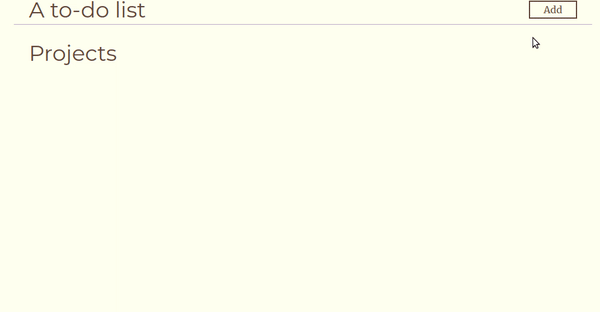

# A to-do list
This is a simple implementation of a to-do list with vanilla html, css, and javascript.
## Description

This is an exercise that taught me how to make a CRUD app from scratch. It also reinforces the use of webpack in the development process. Aside from that, it is a practice session in maintaining the separation of concerns both at a base and general level. The  project was provided by [the odin project](https://www.theodinproject.com/paths/full-stack-javascript/courses/javascript/lessons/todo-list). The web app can be seen [here](https://libmartinito.github.io/todo).
